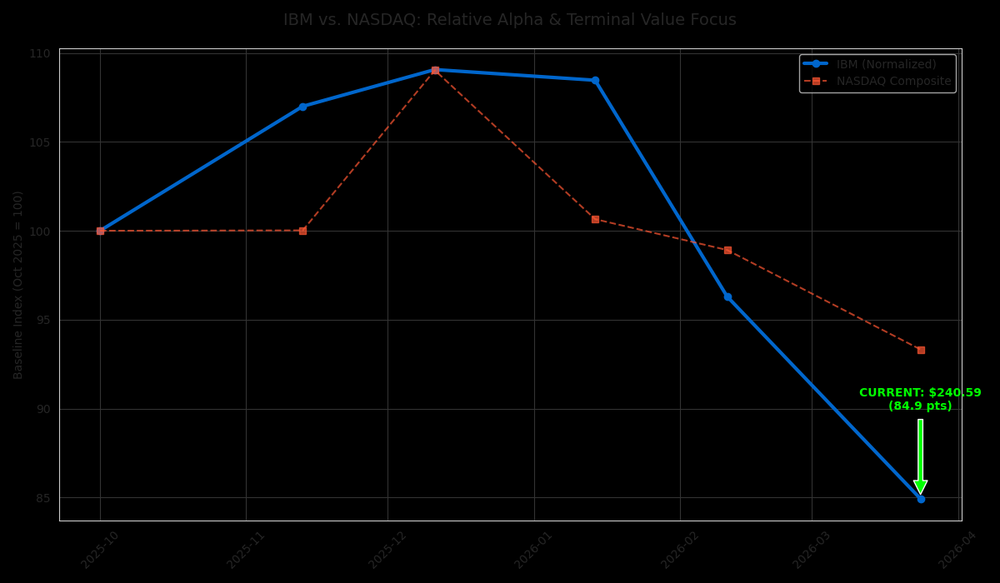
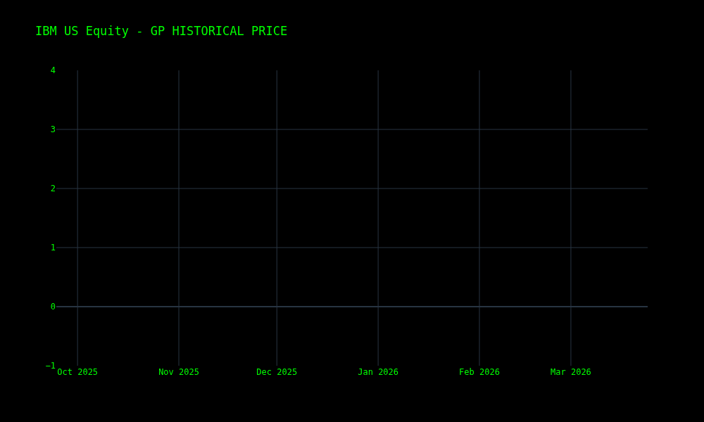

# 📊 IBM Market Intelligence Suite v1.1.0
**A Polyglot Financial Terminal Simulation (C++/Python/Bash)**


## 🏗️ Architecture Overview
This suite simulates a Bloomberg Terminal environment by decoupling performance-critical data parsing from high-fidelity visualization.

- **Performance Tier (C++):** Low-latency execution for real-time price action (BDP).
- **Analytics Tier (Python):** Integrated `yfinance` and `plotly` engines for candlestick charting (GP) and Relative Value (RV) analysis.

## 🚀 Visual Audit (March 24, 2026)

### 1. Relative Alpha Focus (RV)
*Comparison of IBM vs. NASDAQ highlighting today's terminal value.*


### 2. Historical Candlestick (GP)
*6-Month market trajectory generated via the Plotly/Kaleido engine.*


## 🛠️ Usage
```bash
./terminal.sh IBM
Command	Function	Engine
BDP	Real-time Ticker Snapshot	C++
GP	Interactive Candlestick Charting	Python
RV	Relative Alpha vs NASDAQ	Python

Developed by Lauro Beck, DBA
